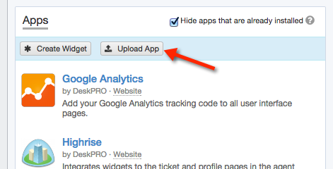
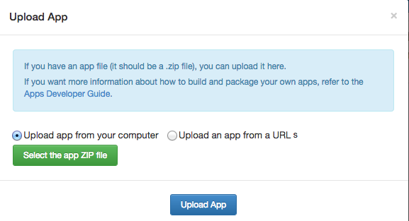

You can create your own DeskPRO Apps like the ones available for installation from **Admin > Apps**. Apps can change the agent interface and integrate it with external systems.

These are some code examples and simple completed Apps:

**example-crm-link**: example code demonstrating how to create a very simple App to add a link under the ticket Properties area (e.g. to an external CRM system or defect tracker).

**example-crm-api**: this example demonstrates how to consume a remote API and render results in a tab in the Ticket view.

**deskpro-default-notetab**: a completed App which changes the default for the ticket reply box to posting an internal agent note instead of sending a reply to the user.

**deskpro-strip-links**: a completed App which removes all links from ticket messages displayed in the agent interface.

**deskpro-ticket-attach-tab**: a completed App which adds a new 'Attachments' tab listing all attachments to the ticket.

To install a completed App to your helpdesk:

* Create a ZIP of the App directory (preserving the subdirectory structure). We have already provided ZIP files for the completed Apps above.
* Go to the **Apps** section of your DeskPRO admin interface.
* Click the **Upload App** button.

* Select the ZIP file from your computer, or provide a URL where it is hosted.

* Enter any configuration information the app requires.
* Click **Install App** to complete the installation.

If you develop a DeskPRO App that you'd like to publish here for others to use, please [create a pull request](https://help.github.com/articles/creating-a-pull-request).
